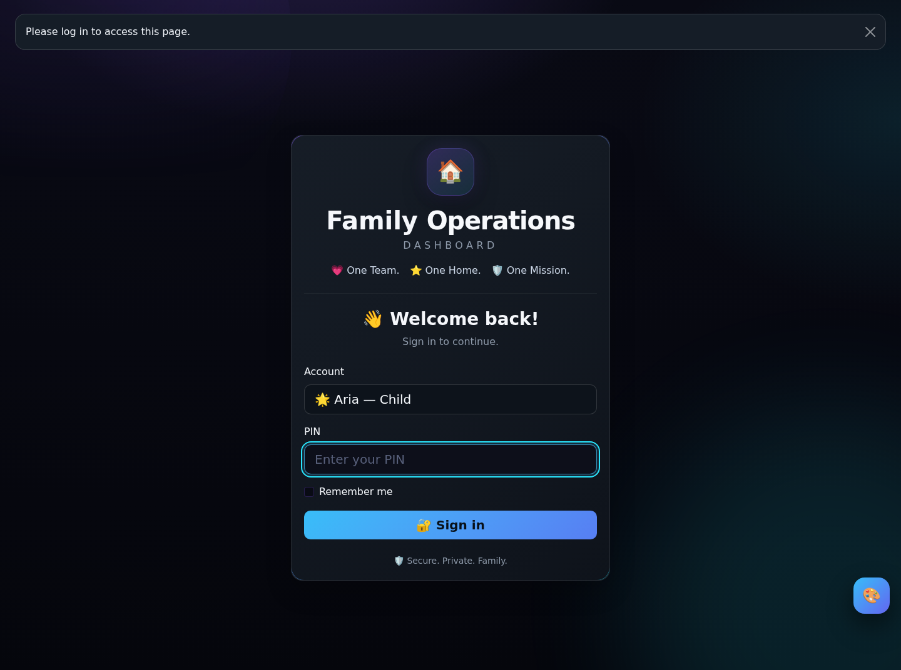
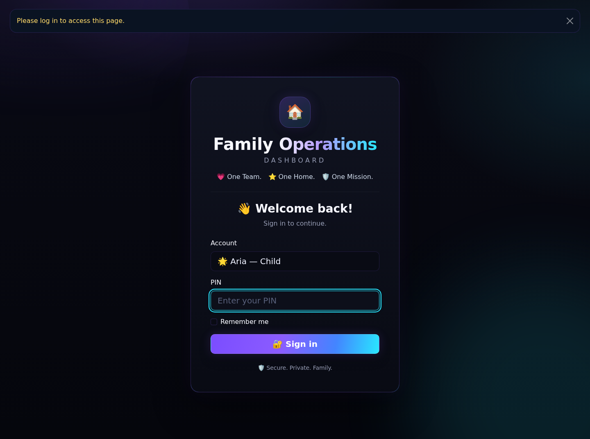

# Family Operations Dashboard v16 · Ultraviolet Neon Household Suite

[](https://github.com/iamrichmack111/family-operations-dashboard/actions/workflows/ci.yml) [](https://github.com/iamrichmack111/family-operations-dashboard/actions/workflows/codeql.yml)

A private, dark-mode Flask household operations system designed for Tailscale Serve.

## Included

- 👑 Parent dashboards for Samantha and Jeremy
- 🗝️ House-manager approval access for Jasmin
- 🌟 Child dashboards for Zara and Aria
- 🔔 role-aware notifications
- 🧹 weighted chore rotation, completion, approval, redo, excuse, notes, weekly locking, and regeneration
- 📸 optional chore-completion photos that appear on the parent/manager approval screen when attached
- ⚖️ strict three-person rotation for Jasmin, Zara, and Aria; Samantha and Jeremy keep parent/admin accounts and receive no automatic chore assignments
- 🧭 personal next-day assignment preview, server-side early-completion protection, and a visible paired deep-clean rotation table
- 📚 homework with due dates, recurring labels, points, attachments, archive, approval, and redo
- 💬 direct messages, replies, read tracking, and optional child-to-child restrictions
- 🔒 private grievances visible and answerable only by parents
- ⚠️ violations with categories, evidence attachments, point deductions, receipt acknowledgement, appeal, parent follow-up, revision history, and resolution
- ⭐ auditable point ledger, reversals, balances, and historical monetary rate snapshots
- 📊 seven Chart.js dashboard graphs, including chore status, weekly review flow, daily point movement, and 30-day reports
- 🧾 filterable activity history and login history in exports
- 📦 CSV, JSON, and SQLite ZIP exports
- 🗄️ automatic rotating SQLite backups at startup
- 🔐 CSRF protection, password hashing, secure cookies, session timeout, and temporary lockouts after repeated failed logins
- 🗓️ 14-day family planner combining chores, homework, appointments, errands, meals, reminders, and events
- ◇ Household HQ with shared shopping, priority supplies, family goals, progress tracking, link rewards, and chore trading
- 🛍️ private link-based rewards: paste a product URL, calculate 3 points per $1 with a hard 350-point maximum, then send it for parent review; only parent accounts can view the stored purchase URL
- 🔐 reward quote privacy: product URLs are kept server-side rather than inside the child browser session
- 📣 household bulletin: pin, prioritize, expire, and archive family announcements
- 🗳️ family polls: create household votes, show live results, and allow one editable vote per user
- 📊 7-day family scorecard: completion percentage, current point balance, and weekly point movement
- ⚡ Ultraviolet Neon theme: near-black surfaces, ultraviolet glow, electric cyan/blue highlights, restrained neon pink, and accessible reduced-motion behavior
- ↔️ chore trade exchange with point escrow, open or targeted offers, instant accepted reassignment, automatic refunds, and paired deep-clean protection
- ◐ persistent Focus Mode plus the neon quick-launch dock
- ▶️ one-command launcher with `./start_dashboard.sh`
- ✅ GitHub Actions CI for Python compilation, unittest regression checks, bundled SQLite integrity, dependency auditing, and Docker build validation
- 🔎 CodeQL security analysis on pull requests, main, weekly schedule, and manual runs
- 📦 GHCR continuous delivery: multi-architecture `linux/amd64` + `linux/arm64` images published after merges to `main` and `v*` tags
- 🤖 Dependabot for weekly Python and GitHub Actions dependency updates


## CI/CD

Pull requests automatically run the test suite, SQLite integrity check, Python dependency audit, Docker build validation, and CodeQL analysis. Merges to `main` publish a multi-architecture image to `ghcr.io/iamrichmack111/family-operations-dashboard`. See `CICD.md` for workflow details and tag behavior.

## Install

```bash
cd ~
unzip ~/Downloads/family-operations-dashboard-v16-three-point-rewards-with-data.zip
cd ~/family-operations-dashboard-main
python3 -m venv .venv
source .venv/bin/activate
python -m pip install --upgrade pip
python -m pip install -r requirements.txt
```

## Start on a free port

```bash
export FAMILY_DASHBOARD_SECRET="$(python -c 'import secrets; print(secrets.token_hex(32))')"
export FAMILY_DASHBOARD_PORT=8011
python run.py
```

Open `http://127.0.0.1:8011`.

Bundled accounts are Samantha, Jeremy, Jasmin, Zara, and Aria. In this packaged database, all five accounts use PIN `1234`. Parents can change any PIN in **Parent Center → Users and PINs**.

## Production server

```bash
source .venv/bin/activate
gunicorn --workers 2 --bind 0.0.0.0:8011 --timeout 60 'wsgi:app'
```

## Tailscale Serve

```bash
sudo tailscale serve reset
sudo tailscale serve --bg http://127.0.0.1:8011
sudo tailscale serve status
```

Use Serve, not Funnel, for private family information.

## Automatic database migration

At startup, the application safely adds the chore photo-proof column when an
older database does not have it. The migration is additive and idempotent: it
does not recreate tables or delete existing users, PIN hashes, chores, points,
or history. The normal rotating database backup runs before an existing SQLite
database is migrated.

To place future model changes under Flask-Migrate:

```bash
export FLASK_APP=wsgi:app
flask db init        # once only
flask db migrate -m "Describe model change"
flask db upgrade
```

## Storage

- Database: `instance/family_dashboard.db`
- Uploaded evidence/homework: `uploads/`
- Chore photo proof: `uploads/chore_proofs/`
- Automatic backups: `backups/`
- Downloadable exports: `exports/`

## Roles

- **Parents:** full administration, PINs, schedules, homework, violations, points, grievances, reports, exports.
- **Manager:** approve or request redo, view operational reports, messages, personal grievances/violations. No parent grievance inbox, PIN controls, violation issuance, or monetary settings.
- **Children:** complete assigned work, view personal points and notices, acknowledge or appeal personal violations, message parents/manager, submit private grievances.

## Chore completion photos

A completion photo is optional. When someone attaches a JPEG, PNG, or WebP image
(up to 8 MB), the server verifies the real image format, rejects animated or
oversized images, strips metadata by re-encoding the upload, and generates a
random safe storage filename. Parents and managers can see attached photos on the
approval screen, and chores can still be approved when no photo was supplied.

Run all migration, photo workflow, approval protection, upload safety, and fair
rotation tests with:

```bash
python -m unittest discover -v
```

## Fair chore rotation

Automatic chores rotate only among Jasmin, Zara, and Aria. Samantha and Jeremy
remain parent/administrative accounts and are never selected by the automatic
rotation. The rotation uses three daily roles: Cook + Dishes, Deep Clean A, and
Deep Clean B. Whoever receives **Cook and dishes** receives no other chore that
day.

**Basement + Laundry** always stay with the same person. **Bathrooms + Kitchen
deep clean** always stay with the same person. Counters and stove travels with
the Basement/Laundry side, while Table/chairs/floor travels with the
Bathrooms/Kitchen side. Daily point loads are therefore 4, 6, and 7; across each
three-day cycle every rotating member receives every chore once and has exactly
17 possible points.

On startup, untouched current and future chores are reconciled to this rotation.
Completed, approved, excused, and Needs Redo records are never reassigned. The
dashboard shows each child or manager their own next-day assignments; parents
see the complete next-day family plan.

After upgrading an existing installation, open **Parent Center → Schedule**,
unlock the current week if needed, and choose **Regenerate** to replace older
untouched assignments with the current rotation. Completed historical chores are
not changed automatically.

## GitHub review workflow

See [`GITHUB_REVIEW.md`](GITHUB_REVIEW.md) for the branch, push, pull-request,
reviewer, and separate-account setup.


## Family News visibility (v4)

All signed-in family members, including Aria and Zara, can open **Family News** and see safe household activity such as chore completion, approvals, homework, messages, schedule actions, and positive recognition.

The shared feed automatically excludes private grievances, detailed violations, PIN/password changes, login history, account administration, monetary-rate changes, backups, exports, and parent-only notes. Each user also has a **My activity** view. Samantha and Jeremy receive a separate **Parent audit** view containing the full administrative record.

## Branch-ready pull request package

This ZIP includes its own Git metadata and opens on a dedicated feature branch.
After extracting it, run `git branch --show-current` to verify the branch, then
run `./submit_pr.sh` to fetch `main`, commit the packaged changes, push the
branch, and open the pull request. See `BRANCH_AND_PR.md` for the manual commands.

## CI/CD

[](https://github.com/iamrichmack111/family-operations-dashboard/actions/workflows/deploy-family.yml)


<!-- RICHMACK-FAMILY-SHOWCASE -->

# Family Operations — Current Build

[](https://github.com/iamrichmack111/family-operations-dashboard/actions/workflows/deploy-family.yml)


A self-hosted family operations platform for chores, homework, points, rewards, approvals, item requests, goals, themes, announcements, and household accountability.

## Features

### Kid Accounts
- Spend My Points
- 25 / 50 / 100 / 250 / 500 point shortcuts
- Custom point deductions
- Balance meter
- Searchable point history
- Savings goals
- Wishlist
- Achievement badges
- Earning streaks
- Family Hub

### Item Requests
- Points deducted immediately when submitted
- Insufficient-balance protection
- Pending / Approved / Denied tracking
- Searchable request history

### Parent Approvals
- Approve
- Approve + Transfer
- Chore and homework filters
- Pending totals
- Confirmation protection
- Double-submit protection
- Safer point reversals

### 100 Themes
- Dark
- Neon
- Nature
- Luxury
- Retro
- Light
- Seasonal
- Kids
- Minimal
- Cosmic
- Search and category filters
- Favorites and recent themes
- Compact mode
- Larger text
- Reduced motion

### Family Hub
- Savings goals
- Wishlist
- Affordability tracking
- Achievement badges
- Point streaks
- Family announcements
- Quick statistics

## Playwright Screenshots

### Dashboard


### Points


### Approvals


## CI/CD

Every push to main can run tests, CodeQL, Docker builds, Playwright screenshots, screenshot updates, and Tailscale deployment to the Family Operations server.

## Production

Live application:

`/home/richmack/v46-new`

Backend:

`127.0.0.1:8011`

Deployment:

GitHub → GitHub Actions → Tailscale → Family Operations Server → Gunicorn :8011 → Tailscale Serve

## Current Release

**v59.1**

